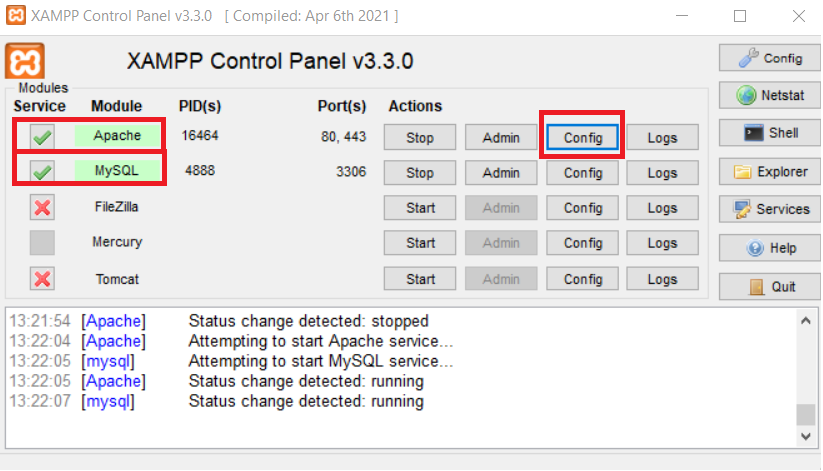
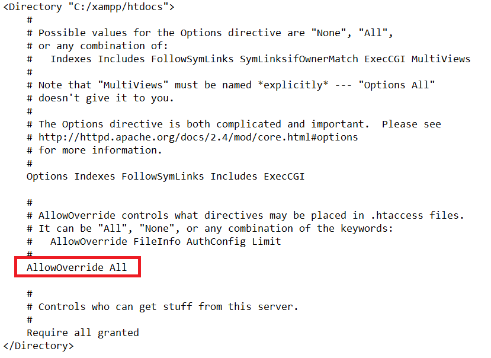
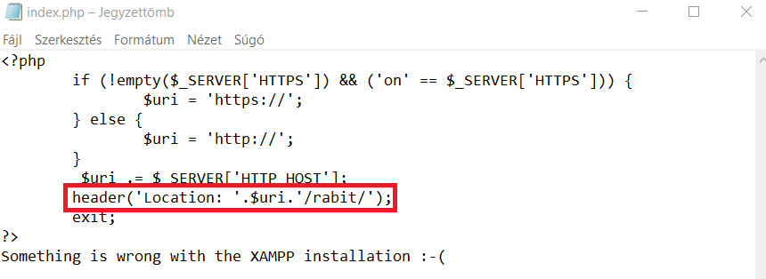

<!-- GETTING STARTED -->
## Getting Started
### Prerequisites

* [Xampp](https://www.apachefriends.org/download.html) installed

### Setup

1. Open Xampp
3. Start Apache Service
4. Start MySQL Service
5. Make sure services are up and running
6. Click on *Config* panel under Apache Service -> Select first one: Apache (httpd.conf)
   
8. Find *directory section* and make sure **AllowOverride All** is commented *OUT*
   
10. Back on XAMPP Control Pane, click on *Explorer* tab and go into *C:\xampp\htdocs* directory
11. Clone the repo into that directory
   ```sh
   git clone https://github.com/csaszargellert/rabit-assignment.git rabit
   ```
11. Inside *C:\xampp\htdocs* directory, in index.php edit the following line
    
13. Back on XAMPP Control Pane, click on *Admin* panel under MySQL Service
14. Once */phpmyadmin* is open in your browser, copy and paste the commands from ***init_db.sql*** file into the console panel of */phpmyadmin*
15. Run commands
16. You are ready to go, visit ***[http://localhost/rabit/](http://localhost/rabit/)***


<!-- CONTACT -->
## Contact

Gellért Császár - [linkedin/csaszargellert](https://www.linkedin.com/in/gellert-csaszar/) - csaszargellert@gmail.com

